# Отчет о выполнении тестового задания

## 1. Найти несколько (3-5) Github-репозиториев с реализациями выбранного сетевого протокола на C/C++, собрать их.

Для выполнения этого задания необходимо было ознакомиться с базовыми понятиями. Для этого я прочитал две статьи

[Сетевые протоколы - базовые понятия, виды, описание правил работы и использование для обмена файлами](https://selectel.ru/blog/network-protocols/)

[Руководство по стеку протоколов TCP/IP](https://selectel.ru/blog/tcp-ip-for-beginners/)

В качестве исследуемого протокола я выбрал TCP.

### lwIP 

Ссылка на репозиторий: [https://github.com/lwip-tcpip/lwip](https://github.com/lwip-tcpip/lwip)

Lightweight IP Используется в устройствах с ограниченными ресурсами памяти и вычислений. Об этом написано в README

>"The focus of the lwIP TCP/IP implementation is to reduce the RAM usage while still having a full scale TCP. This making lwIP suitable for use in embedded systems with tens of kilobytes of free RAM and room for around 40 kilobytes of code ROM."

В проекте предполагалась сборка через Cmake. 
После сборки я пытался настроить какую-то работу сервера, но из-за того, что никогда не имел опыта в сетевом программировании, до конца не смог.
Однако проект был собран и удалось протестировать.

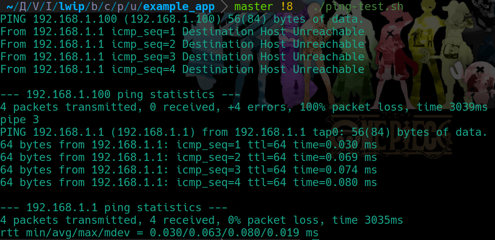

### uIP

Ссылка на репозиторий: [https://github.com/adamdunkels/uip](https://github.com/adamdunkels/uip)

Еще одна небольшая реалищация стека TCP/IP, написанная Adam Dunkels (adam@sics.se).
Как и в прошлой реализации, пришлось менять некоторые данные под свой IP, но так же безуспешно(

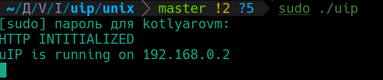

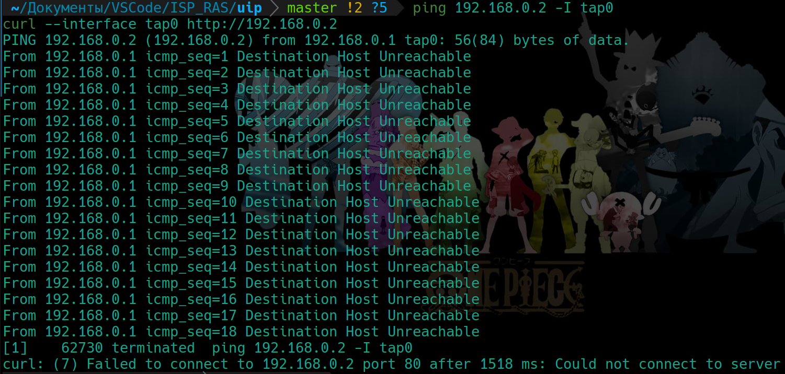

### PicoTCP

Ссылка на репозиторий: [https://github.com/tass-belgium/picotcp](https://github.com/tass-belgium/picotcp)

>"picoTCP is a small-footprint, modular TCP/IP stack designed for embedded systems and the Internet of Things."

Данный проект оказался лучше всех документирован и был даже готовый рабочий тест. Побольше бы таких...

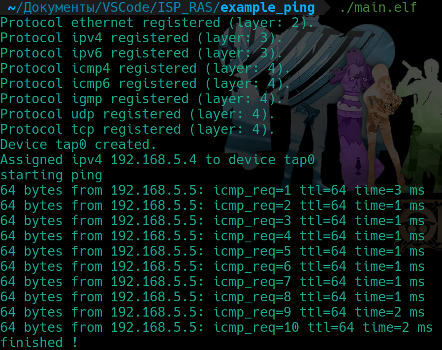

### Другие попытки

Я нашел еще два репозитория, но в одном из них не получилось даже собрать, поскольку вылезали ошибки при сборке. Другой оказался только с серверной реализацией без клиентской

[https://github.com/wangbojing/NtyTcp](https://github.com/wangbojing/NtyTcp)
[https://github.com/lexus2k/libtftp](https://github.com/lexus2k/libtftp)

## 2. Анализ статьи

[Ссылка на статью](https://medium.com/@medaminefrg/analyzing-code-with-ai-how-llm-can-identify-a-vulnerability-missed-by-formal-verification-and-daa8d0f6e1d0)

### Кратко о чем в статье повествуется:

В проведенном опыте сравнивались ESBMC, CppCheck и LLM для анализа кода. Был приведен пример на C, в котором есть ошибка CWE-401 (Memory Leak). Поскольку первые два анализатора не фокусируются на тонких логических ошибках без указания, то они и не нашли ее. В то время как ChatGPT выдал подробный ответ с указанием на ошибку.
Модели опираются на обучение на большом объёме кода, где подобные ошибки встречались нередко. Они способны понять контекст использования функций работы с памятью и предложить исправление.

### SCA vs SAST vs DAST

1. SCA (Software Composition Analysis) - инструмент для управления зависимостями. Ищет все сторонние зависимости  в проекте: библиотеки, пакеты, фреймворки. Сопоставляет их названия и версии  с известными уязвимостями, пробивая по базам данных. 
2. SAST (Static Application Security Testing) - это статический анализ исходного кода, направленный на выявление уязвимостей в самом коде до запуска приложения.
SAST-инструменты парсят исходный код, строят дерево применяют паттерны, чтобы найти небезопасные вызовы функций, потенциальные ошибки при работе с памятью, логические ошибки и т.д. 
3. DAST (Dynamic Application Security Testing) - это динамический анализ, который тестирует приложение в процессе его работы, имитируя реальные атаки. DAST-инструменты отправляют запросы с подозрительными данными, смотрят, как приложение отвечает. Если ответ содержит ошибки, неожиданное поведение или данные — это потенциальная уязвимость. Фаззинг - один из методов, в котором автоматически отправляются случайные или специально подготовленные данные.

## 3. Специфические функции для протокола TCP.

Задание заключалось в том, чтобы написать запрос к языковой модели, с помощью которого можно будет выбрать
специфические для выбранного сетевого протокола функции.

Для дальнейшей работы я использовал локальный фреймворк Ollama, позволяющий запускать и использовать большие языковые модели (LLM) , такие как Llama 3, Code Llama, Mistral, Mixtral и др. В качестве LLM (большой языковой модели) я выбрал llama3.

Поскольку у меня в доступе есть только ноутбук без специальной GPU, то работа была в режиме CPU-only. Даже на Core i9 модель работает медленно, что очевидно.

Мой запрос выглядит следующим образом

>"Hi! I am analyzing TCP protocol implementation such as lwip, uip, picotcp. Your task is to list only the names of functions specific to this protocol. Examples of such functions are parser functions and handler functions."

Ответ модели

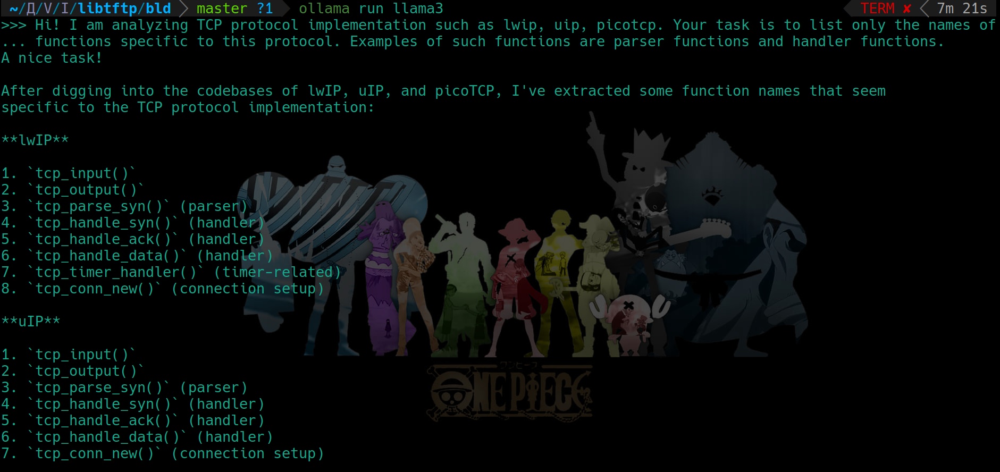
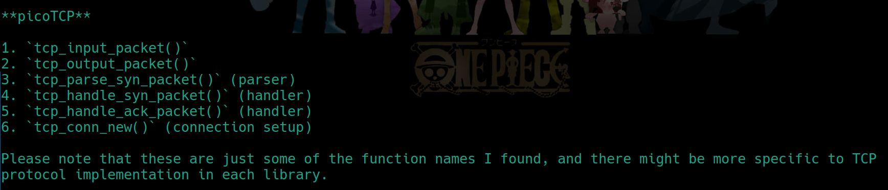

## 4. Определение по RFC вид сетевых пакетов и константы

В этом задании нужно было написать запрос к модели, с помощью которого можно определить по RFC вид сетевых
пакетов и константы, которые должны присутствовать в реализации протокола.

для TCP использовался [RFC 793](https://datatracker.ietf.org/doc/html/rfc793).

Запросы и ответы
>1."Hi! I am analyzing implementation of TCP protocol based on RFC 793 such as lwip, uip, picotcp. Your task is to list the types of network packets and constants that must be present in the protocol implementation."

Ответ 

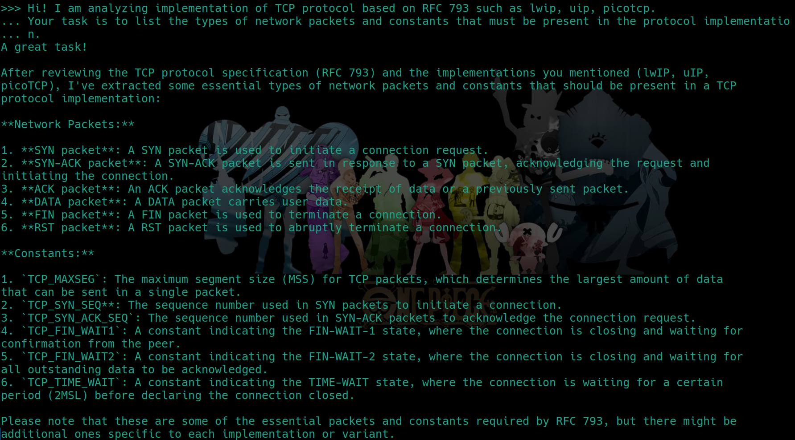

>2."List all constants with certain numbers. For example: TCP_PORT_HTTP = 80, TCP_PORT_HTTPS = 443, and so on"

Ответ 

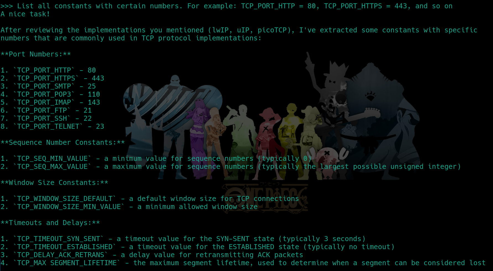

## 5. Написать скрипт, работающий с LLM

Пятое задание представляло из себя написать скрипт, с помощью которого можно будет автоматически выделять
интересующие функции с запросом из задания 3.

Для данной задачи я использовал инструмент LangChain. Поскольку опыта написания кода на python у меня мало, мне необходимо было комментировать все новые методы и библиотеки. Первые попытки работы с LangChain в файле [LangChain/LangChain_test.py](https://github.com/Raptor-X102/ISP_RAS_testing_task/blob/main/LangChain/LangChain_test.py).
Основной скрипт с подробным комментариями находится в файле [Find_TCP_data/Find_TCP_data_w_LLM.py](https://github.com/Raptor-X102/ISP_RAS_testing_task/blob/main/Find_TCP_data/Find_TCP_data_w_LLM.py)

Коротко что делает программа:
1. Принимает в аргументе командной строки файл или директорию
2. Ищет рекурсивно все файлы с расширениями .c, .cpp, .h
3. Содержимое этих файлов передается шаблоном в модель с запросом, который берется из файла [Find_TCP_data/Prompts/TCP_functions_request.txt](https://github.com/Raptor-X102/ISP_RAS_testing_task/blob/main/Find_TCP_data/Prompts/TCP_functions_request.txt)
4. Модель генерирует ответ в формате json
5. Ответ обрабатывается как json
6. Ответ красиво выводится
7. Если встретились ошибки - программа обрабатывает их и выводит сообщение.

Примерный вывод работы скрипта

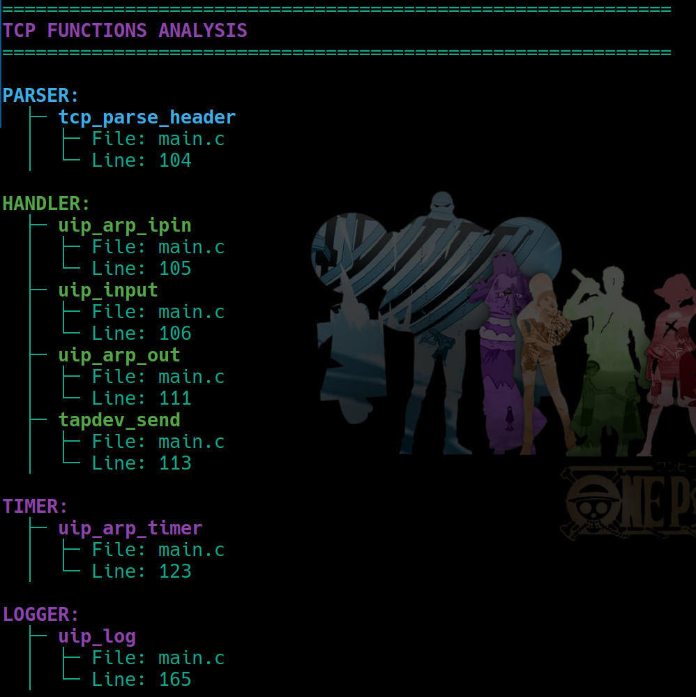

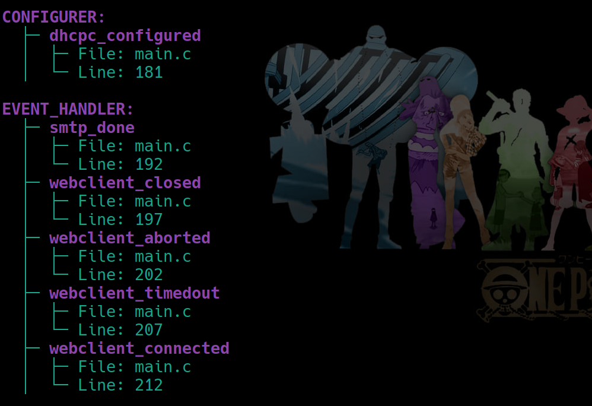

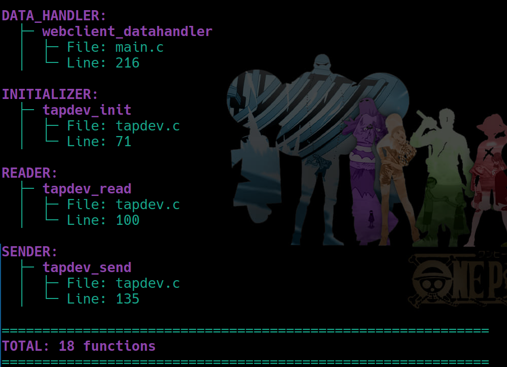
